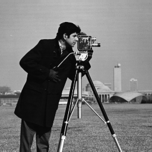
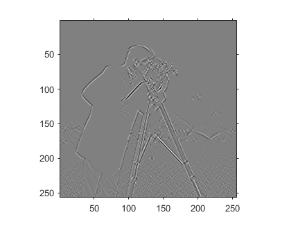
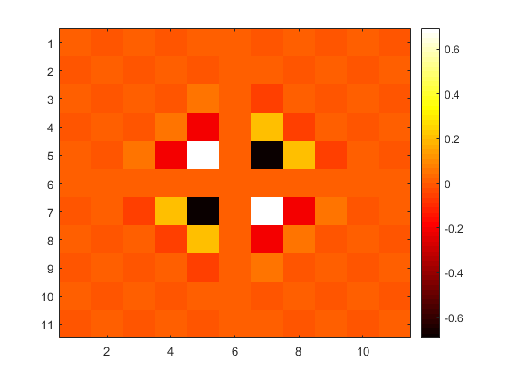

# Centered and Compact Signal and Image derivatives

The provided source code performs the following

 - List item Generates convolution kernels to calculate Signal and Image Derivatives by linear convolution
 - Calculates Signal and Image Derivatives using the work of Lele [--] and Belyayev [--], with a very efficient implementation using causal and anti-causal 1D filtering

Full details can be found in the relevant publication
[IFIP 2013 paper](https://link.springer.com/content/pdf/10.1007/978-3-642-41142-7_33.pdf)

The code can be executed in any version of Matlab and Octave and it does not require any toolboxes.

You are free to use this source code for any academic or non-academic purpose, provided that the code is redistributed as is, with the author credentials, and that the following paper is referenced:

> Delibasis, K. K., Kechriniotis, A., & Maglogiannis, I. (2013, September). On centered and compact signal and image derivatives for feature extraction. In _IFIP International Conference on Artificial Intelligence Applications and Innovations_ (pp. 318-327). Springer, Berlin, Heidelberg

## 1. Generating convolution kernels to calculate Signal and Image Derivatives
This source code implements the theorems for generating the finite impulse response (FIR) filters for signal derivatives of odd and even order. These filters are essentially symmetric finite differences, therefore we will use the terms, central, centered of FIR interchangeably. A very fast numerical implementation of central derivatives is also presented
### Example 1
Calculate the kernel  with length  
for the order  derivative

> K=descrete_deriv(ord,n)

Kernel  is calculated as

> 0.0111,  -0.1500,  1.5000,  -2.7222,  1.5000,  -0.1500,  0.0111

### Example 2
Given an image , calculate the  using a kernel with size 9×9 

We set the following
> n=4;

> ord1=1;

> ord2=1;

Then the following function is called

> [I,kc]=image_der1(I,ord1, ord2, n1,n2)

## Calculating image derivatives using IIR filtering - Compact derivatives
Signal and image derivatives ca nalso be calculated using compact derivatives. This is a sophisticated method that involves both FIR filetring (centered differences) as well as solving a tridiagonal or pentadiagonal system of linear equations. In our work, the later part has been formulaed as a cascade of causal and anticausal filter. For more details, see our [IFIP 2013 paper](https://link.springer.com/content/pdf/10.1007/978-3-642-41142-7_33.pdf).

Any combination of 1st and 2nd order derivatives of any image  I is supported by the provided source code . 
> [Ix,Iy,Ixy,Ixx,Iyy,Ixyy,Ixxy,Ixxyy]=image_der_IIR(I,n1,n2);

n1 is the accuracy of the 1st derivative, with possible values 6, 8 and 10

n2 is the accuracy of the 2nd derivative, with possible values 4, 6, 8 and 10

StackEdit stores your files in your browser, which means all your files are automatically saved locally and are accessible **offline!**

## Export a file

You can export the current file by clicking **Export to disk** in the menu. You can choose to export the file as plain Markdown, as HTML using a Handlebars template or as a PDF.

# Synchronization

Synchronization is one of the biggest features of StackEdit. It enables you to synchronize any file in your workspace with other files stored in your **Google Drive**, your **Dropbox** and your **GitHub** accounts. This allows you to keep writing on other devices, collaborate with people you share the file with, integrate easily into your workflow... The synchronization mechanism takes place every minute in the background, downloading, merging, and uploading file modifications.

There are two types of synchronization and they can complement each other:

- The workspace synchronization will sync all your files, folders and settings automatically. This will allow you to fetch your workspace on any other device.
	> To start syncing your workspace, just sign in with Google in the menu.

- The file synchronization will keep one file of the workspace synced with one or multiple files in **Google Drive**, **Dropbox** or **GitHub**.
	> Before starting to sync files, you must link an account in the **Synchronize** sub-menu.

## Open a file

You can open a file from **Google Drive**, **Dropbox** or **GitHub** by opening the **Synchronize** sub-menu and clicking **Open from**. Once opened in the workspace, any modification in the file will be automatically synced.

## Manage file publication

Since one file can be published to multiple locations, you can list and manage publish locations by clicking **File publication** in the **Publish** sub-menu. This allows you to list and remove publication locations that are linked to your file.

Hi! I'm your first Markdown file in **StackEdit**. If you want to learn about StackEdit, you can read me. If you want to play with Markdown, you can edit me. Once you have finished with me, you can create new files by opening the **file explorer** on the left corner of the navigation bar.

